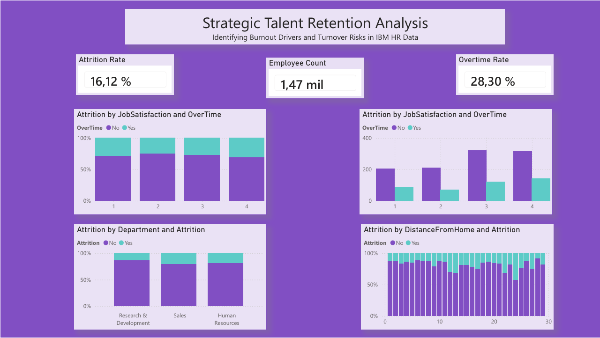

# Strategic Talent Retention Analysis | IBM HR Analytics

## Resumen del Proyecto
Este proyecto analiza los factores clave de la rotación de personal (attrition) en un entorno corporativo. Utilizando un dataset de **1,470 empleados**, desarrollé un dashboard interactivo para visualizar patrones entre el equilibrio vida-trabajo, la satisfacción laboral y la renuncia de talentos.

El objetivo es proporcionar insights basados en datos que ayuden a los departamentos de RR.HH. a reducir costos de rotación y mejorar la salud organizacional.

## Hallazgos Clave y KPIs
* **Tasa de Rotación (16.12%):** El indicador base de bajas en la organización.
* **El Factor "Overtime":** Los empleados que trabajan horas extras muestran una tendencia significativamente mayor a renunciar (burnout).
* **Satisfacción Laboral:** Niveles bajos de satisfacción en Ventas e I+D son los principales detonantes de pérdida de talento.
* **Distancia al Hogar:** Existe una correlación clara entre la distancia de la oficina y la decisión de dejar la empresa.

## Stack Tecnológico
* **Power BI:** Diseño de dashboard y visualización avanzada.
* **DAX:** Medidas dinámicas para Attrition Rate y recuentos de empleados (1.47k total).
* **SQL:** Consultas para validación de métricas y análisis de base de datos.

## Archivos del Repositorio
* **`dashboard_IBM.pbix`**: Archivo original de Power BI con el reporte interactivo.
* **`attrition_queries.sql`**: Scripts de SQL con la lógica de negocio y validación de KPIs.
* **`dashboard_IBM.png`**: Vista previa visual del tablero en alta resolución.
* **`hr_data_limpio.xlsx`**: Dataset procesado y utilizado para el análisis final.

## Vista Previa del Dashboard

## Recomendaciones de Negocio
1. **Control de Burnout:** Limitar las horas extras recurrentes para frenar la rotación.
2. **Flexibilidad:** Implementar opciones de teletrabajo para empleados a más de 15 millas de la oficina.
3. **Foco en Ventas:** Priorizar programas de compromiso en el departamento de Ventas.

---
**Rol:** Data Analyst  
**Herramientas:** Power BI | SQL | DAX
